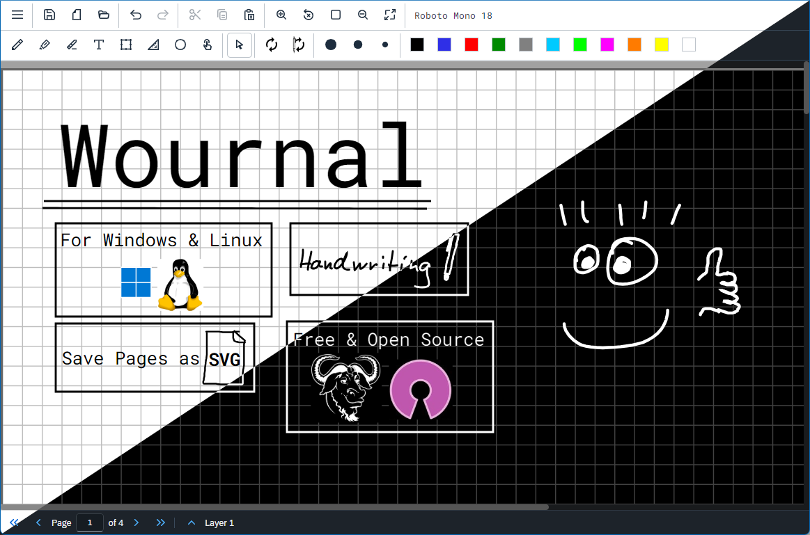
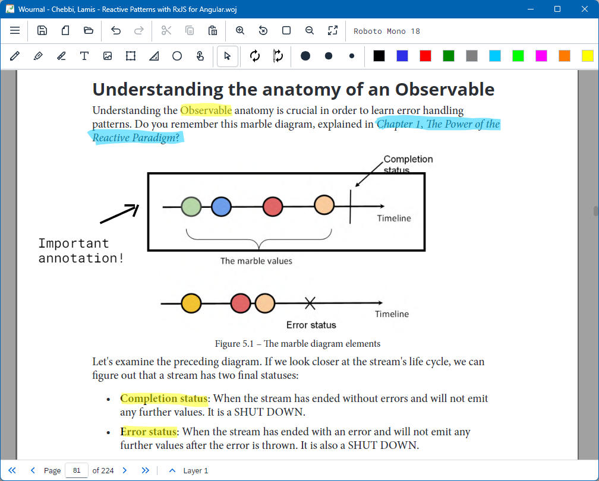

# Wournal

Wournal is an app that is probably best described as "digital paper". You can
freely put your handwriting, text, images and vector graphics on a canvas that
is about as easy to use as paper, freeing up your brain to focus on the subject
matter.

- Can be used to annotate PDF documents
- Supports Windows and GNU/Linux. (Android support is planned, MacOS/iOS open to
  contribution)
- Save single-page documents as SVG to interoperate with other software.
- Respect system dark/light mode.





## Current Project Status

Wournal just released (2024-01-07) as an alpha version. There may still be some
bugs creeping around, but it should be mostly stable.

There are lots of things planned for the future (see below), but the biggest
thing still missing is an *Android version*.

<details>
  <summary>Development Roadmap</summary>
  
  **Known Issues**:
  
  - High DPI / Scaling is not Ideal
    - Zooming PDF Documents Looks a Bit Weird
    - Text Rendering on Default Zoom Level can be Slightly Blurry

  **Before Beta**:

  - [ ] Store Config as File Instead of in LocalStorage
  - [ ] PDF Annotation with [pdf-js](https://mozilla.github.io/pdf.js/)
    - [x] Viewing & Annotating
    - [x] Highlight Text
    - [ ] Choose between attaching PDF to WOJ, Relative or Absolute File Path
  - [x] Exporting to PDF with [pdf-lib](https://pdf-lib.js.org/)
  - [x] Table of Contents
    - [x] Auto Import From PDF
  - [ ] Tabs
  - [ ] Tablet (and Phone) Friendly UI
  - [ ] Android Version with Cordova or Capacitor
  - [x] Stack Trace & Bug Report Dialog
  - [x] Auto Saves
  - [x] Single Click to Select
  - [ ] Polish Icon (especially lower resolution versions)
  - [ ] Simple Website with some Documentation with GitHub Pages

  **Before 1.0**

  - [x] Default Document Zoom Level Config Option
  - [x] Drag&Drop From File Manager to Open
  - [ ] Jumplist
  - [ ] Customizable Pen Cursor Angle Change (Especially for Lefties)
  - [ ] Lasso Select
  - [ ] Set Default Paper Style
  - [ ] Vertical Space Tool
  - [ ] Rotate Selection
  - [x] Notify Update & Display Changelog

  **(Probably/Maybe) After 1.0**

  - [ ] Different Page Layouts
    - [ ] Single Page
    - [ ] Two Pages (Continuous)
  - [ ] Annotate Multiple PDFs in one Wournal Document
  - [ ] Import XOJ (from Xournal)
  - [ ] Import Annotations from a PDF (at least a bit)
  - [ ] Apply New Page Style to All Pages
  - [ ] Laser Pointer
  - [ ] Custom "Sticker" or "Element" Collections (like Google Material Icons or
        Cisco Networking Diagram Thingies)
  - [ ] Page Thumbnails in Left Panel
  - [ ] Put Text Marker Strokes on a Separate Layer to Always Have Text In Front
    - Xournal does not do this, Xournal++ and PDF Annotator do
  - [ ] A Textfield with Syntax Highlighting for Various Programming Langs

</details>

## Lineage and Thanks

Wournal is primarily inspired by the wonderful [Xournal][XOJ] and can therefore
be seen as part of a whole lineage of programs written over the years like the
venerable [Microsoft Windows Journal][JNT], [Jarnal][JAJ] or the more modern
[Xournal++][XOPP] and [MrWriter][MOJ].

In addition to all developers of these programs, `ConnorsFan` on
[StackOverflow][ACK1] also deserves a big thank your for the initial basic
template for the line smoothing algorithm.

[XOJ]: http://xournal.sourceforge.net/
[XOPP]: https://xournalpp.github.io/
[JNT]: https://en.wikipedia.org/wiki/Windows_Journal
[JAJ]: http://www.dklevine.com/general/software/tc1000/jarnal.htm
[MOJ]: https://unruhschuh.github.io/MrWriter/

[ACK1]: https://stackoverflow.com/a/40700068

## Why write this when *X* exists?

Most of the programs in the lineage of Wournal have not been maintained for a
long time, with three exceptions:

- **[Xournal++](https://xournalpp.github.io/)** is written for GTK in C++. This
  has some advantages, but it also introduces a number of issues. Porting to
  Android/iOS is impossible, development and debugging production builds can be
  quite intimidating and subtle differences in behaviour can and do cause
  instability on Windows. Additionally, embedding a web app like Wournal can be
  done in many more environments then a native app like Xournal++. Xournal++ is
  a wonderful project that deserves a lot of respect for pushing FOSS note
  taking software, but it does have some limitations that make it deserving of
  competition.

- **[PDF Annotator](https://www.pdfannotator.com/)** is a proprietary
  Windows-only application (probably written in .NET). It slows down
  significantly with documents containing a decent amount of handwriting. And it
  can be a bit expensive for a casual note taker or broke student.

- **[MrWriter](https://unruhschuh.github.io/MrWriter/)** is written for Qt in
  C++, which means it inherits some of the issues mentioned for Xournal++. It is
  in a similar state of development as Wournal, but it struggles with
  performance on Windows.

There are likely some competitors that are not mentioned here. If you feel some
program is missing here, feel free to expand this section!

## Development

Wournal is a mostly relatively normal electron app, except that it uses
[mvui](https://github.com/dominiksta/mvui) as a frontend framework. I know, I
know, we really need more javascript frameworks, but there were some good
reasons to choose it, mainly that a tiny framework like mvui means that Wournal
should be easily maintainable long into the future... and it was also kind of
fun. You should really not be scared to contribute because of this, you can
reproduce most common React patterns in mvui.

```{bash}
git clone --recurse-submodules https://github.com/dominiksta/wournal/
npm i
npm run dev
```

### Building

Building for Windows on GNU/Linux is possible by installing `wine` and
`mono`. On Ubuntu, installing `wine64` and `mono-complete` speifically should
work. Building for GNU/Linux on Windows can be achieved through WSL2. See the
[Electron Forge documentation][EFD] for details.

[EFD]: https://www.electronforge.io/core-concepts/build-lifecycle

```bash
npm run package # build binary for current os

npm run make # build distributables for current os

# for building windows on linux/wsl (ubuntu 22.04 lts specifically)
sudo apt install wine64 mono-complete
npm run make -- --platform=win32 --targets=zip
# the `wix` target can only be built on a real windows machine
```
